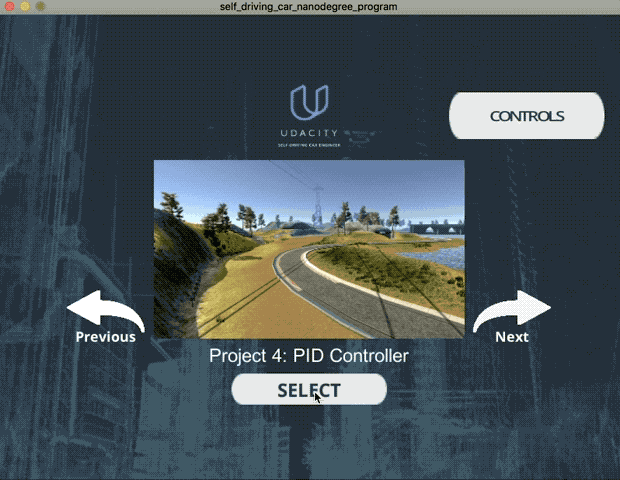

# PID Controller
Self-Driving Car Engineer Nanodegree Program

---

### Introduction

The goal of this project was to build a PID Controller and optimize hyper-parameters to autonomously drive Udacity car simulator. The simulator can interact with the C program over a websocket. The simulator provide Cross Track Error (cte) indicating how far the car is away from the center line. The C program can control the steering wheel and throttle by sending specific messages in the websocket channel.
The PID Controller implemented in `PID.cpp` responds with steering and throttle based on the CTE from simulator.

### Results and Discussion

##### Proportional Controller
* P - Control has a direct effect on the error value (cte), the more the error the P-Controller will actuate the steering/throttle in T (tau) times the error pushing the vehicle back into the straight line.
* This will cause the vehicle to reach the center line but will further push it away eventually increasing CTE in the negative direction.
* As the P controller constantly pushes the car into the center lane, the car will overshoot itself cause a wavy pattern in the trajectory.
* Image 1, show this behavior of P-controller on the vehicle.

Image 1

##### Differential Controller
* The D - Controller attempts to prevent the overshoot by considering the derivative or the change in the error value (cte).
* This reduces the magnitude of control actuation on the vehicle as it nears the center line, eventually bringing CTE all the way down to zero.  
* Image 2, from the quiz, shows the effect of D-controller on the trajectory of the vehicle.

Image 2

##### Integral Controller
* The I - Controller tries to counter any inherent errors in the control system. It aggregates the historical (hence the integral) errors and proportionately controls the output.  
* Image 3, from the quiz, shows the effect of I-controller on the trajectory of the vehicle.

Image 3

##### Hyperparameters

Attempted to run Twiddle and arrive at the hyperparameters, but it was causing the code to become quite unstable, definitely implementing Twiddle right way will help arrive the right hyperparameters for PID controller. As of now, this project has manually optimized hyperparameter based on the experience from attempting Twiddle implementation. The drawback with this primitive setup was the speed of simulation was fairly limited.

Having just one PID controller for actuating the steering wheel resulted in a smooth control of the vehicle in the simulator. When a second controller was added to actuate the throttle, the execution in the simulator was wavy the PID was overcontrolling the system. But it was able to accomplish higher speeds.

As far the manual optimization goes, it was very surprising to see the differential component had less impact than the integral component. If the simulator was built with basic physics engine in Unity, it would have responded more for the proportional and differential component and than the integral component. It sounds like the simulator was programmed considering some real world factors to closely simulate on road conditions.

### Video
 
[YouTube Link](https://youtu.be/Vpj_hF4iM1E)

##### Quick Animation

### Basic Build Instructions

1. Clone this repo.
2. Make a build directory: `mkdir build && cd build`
3. Compile: `cmake .. && make`
4. Run it: `./pid`. 
